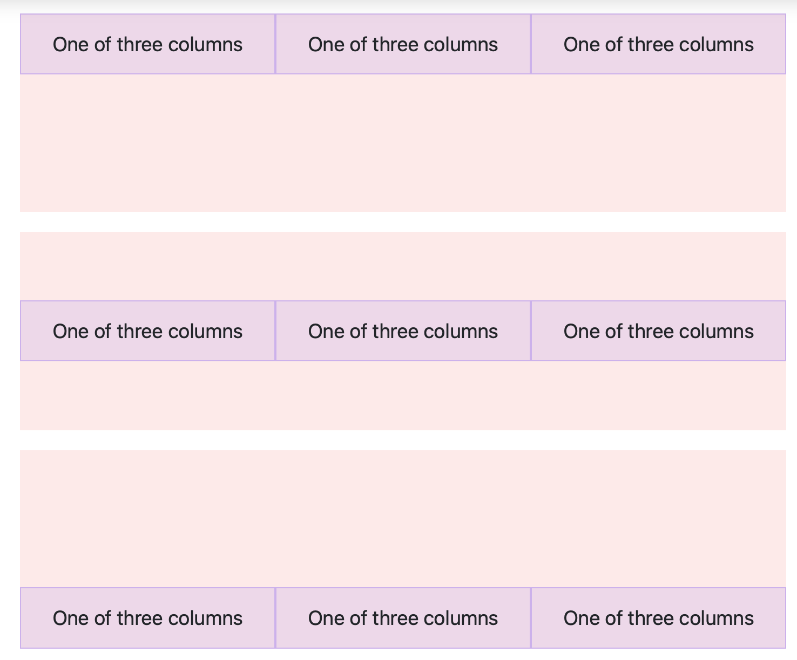
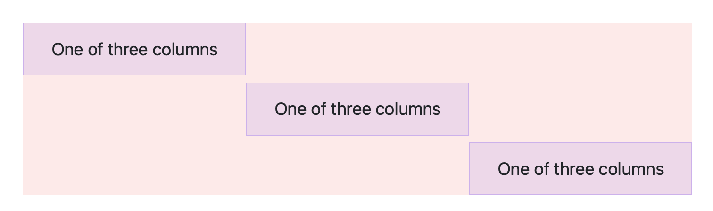
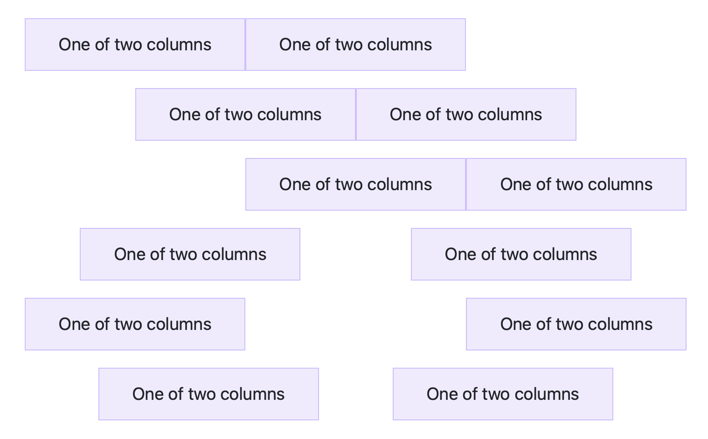
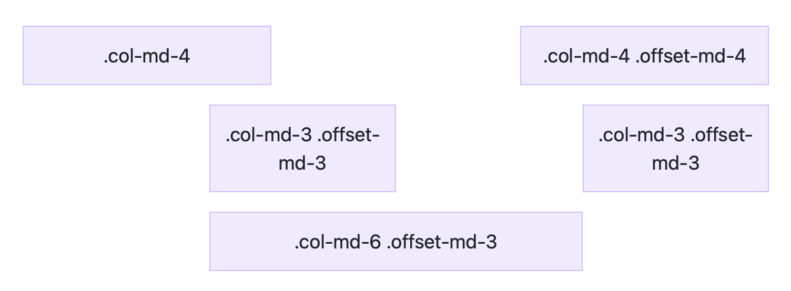

## 對齊
### 垂直對齊
#### 整欄垂直對齊

- align-items-start
- align-items-center
- align-items-end
- [所有欄對齊範例](./vertical_alignment.html)

```html
<!--所有欄對齊範例-->
<div class="container text-center">
  <div class="row align-items-start">
    <div class="col">
      One of three columns
    </div>
    <div class="col">
      One of three columns
    </div>
    <div class="col">
      One of three columns
    </div>
  </div>
  <div class="row align-items-center">
    <div class="col">
      One of three columns
    </div>
    <div class="col">
      One of three columns
    </div>
    <div class="col">
      One of three columns
    </div>
  </div>
  <div class="row align-items-end">
    <div class="col">
      One of three columns
    </div>
    <div class="col">
      One of three columns
    </div>
    <div class="col">
      One of three columns
    </div>
  </div>
</div>
```

#### 單欄垂直對齊


- align-self-start
- align-self-center
- align-self-end
- [單欄對齊範例](./vertical_alignment_single_column.html)

```html
<div class="container text-center">
  <div class="row">
    <div class="col align-self-start">
      One of three columns
    </div>
    <div class="col align-self-center">
      One of three columns
    </div>
    <div class="col align-self-end">
      One of three columns
    </div>
  </div>
</div>
```

### 水平對齊



- justify-content-start
- justify-content-center
- justify-content-end
- justify-content-around
- justify-content-between
- justify-content-evenly
- [範例](./horizontal_alignment.html)

```html
<div class="container text-center">
  <div class="row justify-content-start">
    <div class="col-4">
      One of two columns
    </div>
    <div class="col-4">
      One of two columns
    </div>
  </div>
  <div class="row justify-content-center">
    <div class="col-4">
      One of two columns
    </div>
    <div class="col-4">
      One of two columns
    </div>
  </div>
  <div class="row justify-content-end">
    <div class="col-4">
      One of two columns
    </div>
    <div class="col-4">
      One of two columns
    </div>
  </div>
  <div class="row justify-content-around">
    <div class="col-4">
      One of two columns
    </div>
    <div class="col-4">
      One of two columns
    </div>
  </div>
  <div class="row justify-content-between">
    <div class="col-4">
      One of two columns
    </div>
    <div class="col-4">
      One of two columns
    </div>
  </div>
  <div class="row justify-content-evenly">
    <div class="col-4">
      One of two columns
    </div>
    <div class="col-4">
      One of two columns
    </div>
  </div>
</div>
```

### 偏移column



- offset-*
- [範例](./offset.html)

```html
<div class="container text-center">
  <div class="row">
    <div class="col-md-4">.col-md-4</div>
    <div class="col-md-4 offset-md-4">.col-md-4 .offset-md-4</div>
  </div>
  <div class="row">
    <div class="col-md-3 offset-md-3">.col-md-3 .offset-md-3</div>
    <div class="col-md-3 offset-md-3">.col-md-3 .offset-md-3</div>
  </div>
  <div class="row">
    <div class="col-md-6 offset-md-3">.col-md-6 .offset-md-3</div>
  </div>
</div>
```