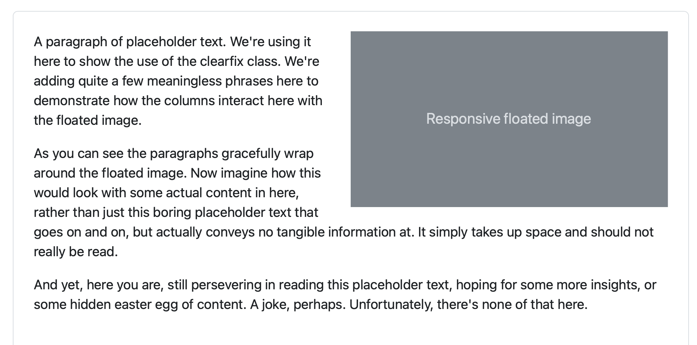

## 對齊
### 垂直對齊
#### 整欄垂直對齊

- align-items-start
- align-items-center
- align-items-end
- [所有欄對齊範例](./vertical_alignment.html)

```html
<!--所有欄對齊範例-->
<div class="container text-center">
  <div class="row align-items-start">
    <div class="col">
      One of three columns
    </div>
    <div class="col">
      One of three columns
    </div>
    <div class="col">
      One of three columns
    </div>
  </div>
  <div class="row align-items-center">
    <div class="col">
      One of three columns
    </div>
    <div class="col">
      One of three columns
    </div>
    <div class="col">
      One of three columns
    </div>
  </div>
  <div class="row align-items-end">
    <div class="col">
      One of three columns
    </div>
    <div class="col">
      One of three columns
    </div>
    <div class="col">
      One of three columns
    </div>
  </div>
</div>
```

#### 單欄垂直對齊


- align-self-start
- align-self-center
- align-self-end
- [單欄對齊範例](./vertical_alignment_single_column.html)

```html
<div class="container text-center">
  <div class="row">
    <div class="col align-self-start">
      One of three columns
    </div>
    <div class="col align-self-center">
      One of three columns
    </div>
    <div class="col align-self-end">
      One of three columns
    </div>
  </div>
</div>
```

### 水平對齊


- justify-content-start
- justify-content-center
- justify-content-end
- justify-content-around
- justify-content-between
- justify-content-evenly
- [範例](./horizontal_alignment.html)

```html
<div class="container text-center">
  <div class="row justify-content-start">
    <div class="col-4">
      One of two columns
    </div>
    <div class="col-4">
      One of two columns
    </div>
  </div>
  <div class="row justify-content-center">
    <div class="col-4">
      One of two columns
    </div>
    <div class="col-4">
      One of two columns
    </div>
  </div>
  <div class="row justify-content-end">
    <div class="col-4">
      One of two columns
    </div>
    <div class="col-4">
      One of two columns
    </div>
  </div>
  <div class="row justify-content-around">
    <div class="col-4">
      One of two columns
    </div>
    <div class="col-4">
      One of two columns
    </div>
  </div>
  <div class="row justify-content-between">
    <div class="col-4">
      One of two columns
    </div>
    <div class="col-4">
      One of two columns
    </div>
  </div>
  <div class="row justify-content-evenly">
    <div class="col-4">
      One of two columns
    </div>
    <div class="col-4">
      One of two columns
    </div>
  </div>
</div>
```

### 偏移column


- offset-*
- [範例](./offset.html)

```html
<div class="container text-center">
  <div class="row">
    <div class="col-md-4">.col-md-4</div>
    <div class="col-md-4 offset-md-4">.col-md-4 .offset-md-4</div>
  </div>
  <div class="row">
    <div class="col-md-3 offset-md-3">.col-md-3 .offset-md-3</div>
    <div class="col-md-3 offset-md-3">.col-md-3 .offset-md-3</div>
  </div>
  <div class="row">
    <div class="col-md-6 offset-md-3">.col-md-6 .offset-md-3</div>
  </div>
</div>
```

### 利用margin工具
- me-auto
- [範例](./margin.html)

```
<div class="container text-center">
  <div class="row">
    <div class="col-md-4">.col-md-4</div>
    <div class="col-md-4 ms-auto">.col-md-4 .ms-auto</div>
  </div>
  <div class="row">
    <div class="col-md-3 ms-md-auto">.col-md-3 .ms-md-auto</div>
    <div class="col-md-3 ms-md-auto">.col-md-3 .ms-md-auto</div>
  </div>
  <div class="row">
    <div class="col-auto me-auto">.col-auto .me-auto</div>
    <div class="col-auto">.col-auto</div>
  </div>
</div>
```


### 只有一個column,設定百分比的寬

- [範例](./standalone_column.html)

```
<div class="col-3 bg-light p-3 border">
  .col-3: width of 25%
</div>
<div class="col-sm-9 bg-light p-3 border">
  .col-sm-9: width of 75% above sm breakpoint
</div>
```


### clearfix

- [範例]

```
<div class="clearfix">
  

  <p>
    A paragraph of placeholder text. We're using it here to show the use of the clearfix class. We're adding quite a few meaningless phrases here to demonstrate how the columns interact here with the floated image.
  </p>

  <p>
    As you can see the paragraphs gracefully wrap around the floated image. Now imagine how this would look with some actual content in here, rather than just this boring placeholder text that goes on and on, but actually conveys no tangible information at. It simply takes up space and should not really be read.
  </p>

  <p>
    And yet, here you are, still persevering in reading this placeholder text, hoping for some more insights, or some hidden easter egg of content. A joke, perhaps. Unfortunately, there's none of that here.
  </p>
</div>
```


