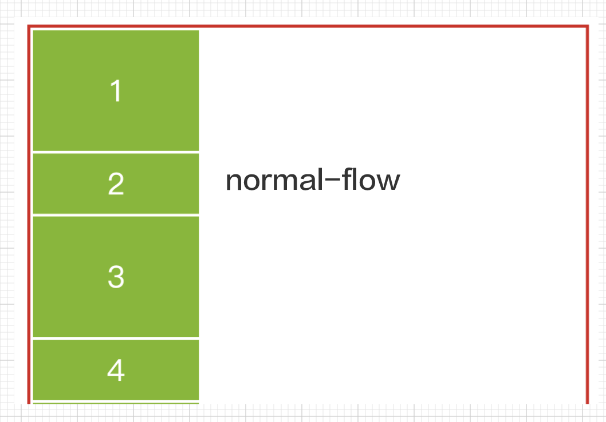
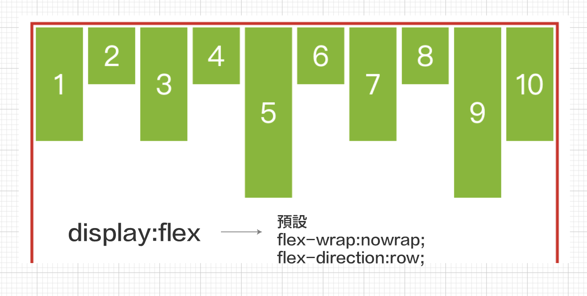
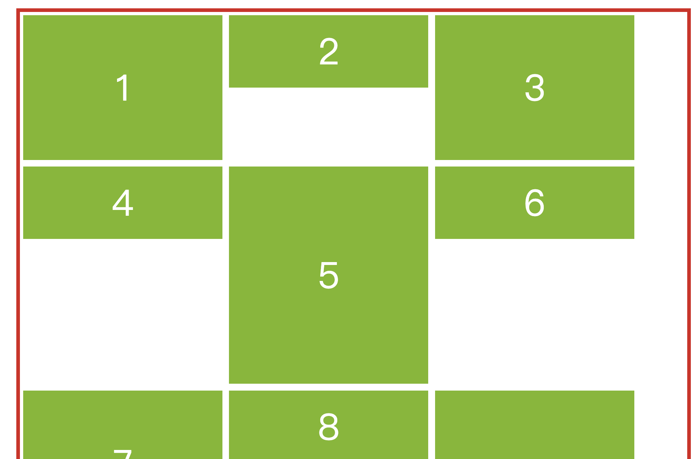
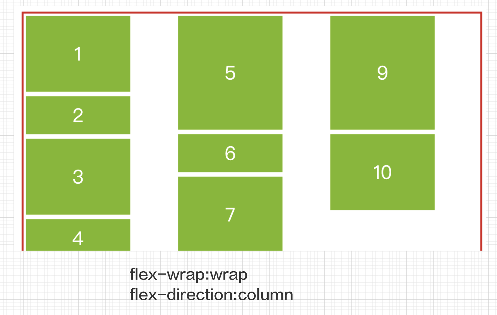
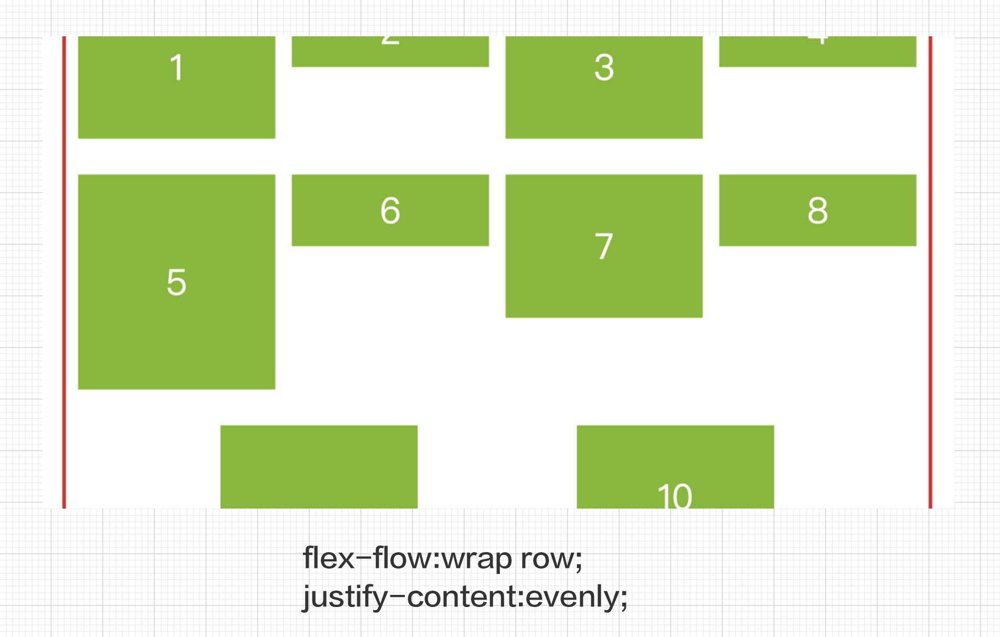
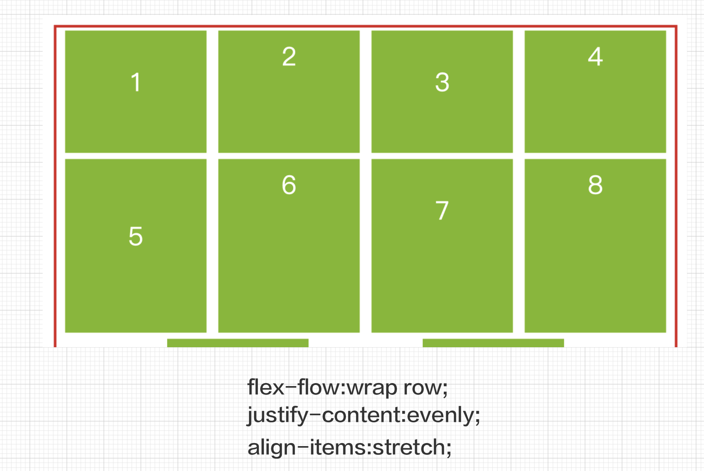

## CSS Flex
## Flex常見的語法:
1. display
2. flex-wrap
3. flex-direction
4. flex-flow(同時設定flex-direction和flex-wrap)
5. justify-content
6. align-item
7. align-content
8. align-self
9. order
10. flex(flex-grow, flex-shrink,flex-basis)

### 預設編排(normal flow)



- no display:flex [範例](./no_display_flex.html)

```html
<div class="flex_container">
    <div class="font box box_normal">1</div>
    <div class="font box box_short">2</div>
    <div class="font box box_normal">3</div>
    <div class="font box box_short">4</div>
    <div class="font box box_long">5</div>
    <div class="font box box_short">6</div>
    <div class="font box box_normal">7</div>
    <div class="font box box_short">8</div>
    <div class="font box box_long">9</div>
    <div class="font box box_normal">10</div>
</div>
```

```css
<style type="text/css">
        .flex_container {
            border: solid 5px rgb(216, 30, 30);
            height: 950px;
            margin: 2%;
        }

        .font {
            color: #fff;
            text-align: center;
            font-size: 50px;
        }

        .box {
            background-color: rgb(124, 185, 25);
            margin: 0.5%;
            width: 275px;
        }

        .box_normal {
            height: 200px;
            line-height: 200px;
        }

        .box_short {
            height: 100px;
            line-height: 100px;
        }

        .box_long {
            height: 300px;
            line-height: 300px;
        }
    </style>
```

### flex編排(display:flex)
- display:flex
- default:
	- flex-wrap:nowrap
	- flex-direction:row

- [範例](./display_flex.html)



### flex-wrap
屬性值:
1. nowrap(不換行)
2. warp(換行)
3. wrap-reverse(換行-反轉)

```
	flex-wrap: wrap | nowrap | wrap-reverse
```

- [範例](./flex_wrap.html)


### flex-direction
屬性值:
1. row(預設值)
2. row-reverse
3. column
4. column-reverse

```css
	flex-direction:row | row-reverse | column | column-reverse
```

- [範例](./flex_direction.html)



### flex-flow

- 整合flex-wrap,flex-direction
- [範例](./flex_flow.html)

```
	flex-flow:column wrap
```

### justify-content

- 水平對齊

屬性值:
- flex-start
- center
- flex-end
- space-around
- space-between
- space-evenly

```
	justify-content:flex-start | flex-end | center | space-around | space-between | space-evenly
```

- [範例](./justify_content.html)



### align-items
- 以一row內元素組為主,垂直對齊

1. stretch(預設值,內元素不可以設定height)
2. flex-start
3. center
4. flex-end
5. baseline

```
	align-items:stretch | flex-start | flex-end | center | baseline;
```

- [範例](./align_items.html)




### align-content
- 以 row為對齊單位

```
	flex-wrap:wrap;
	align-content: stretch | flex-start | flex-end | center | space-around | space-between | space-evenly;
```

- [範例](./align_content.html)


